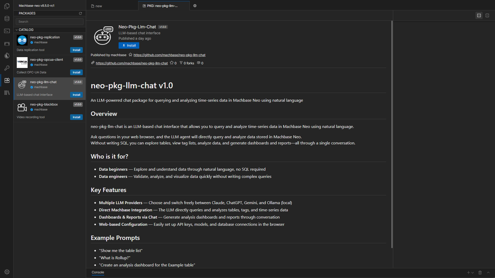
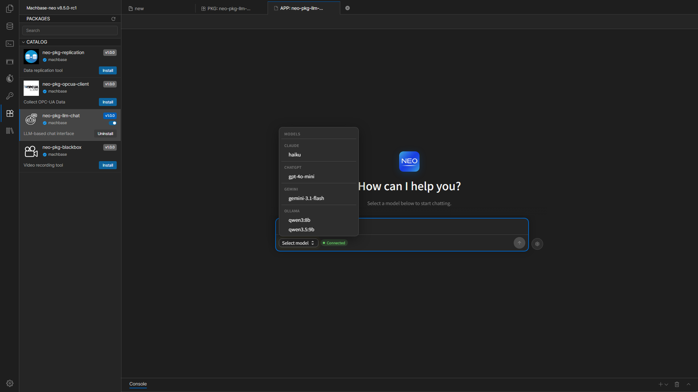

# LLM Chat Technical Documentation

The Machbase Neo LLM Chat package is an LLM-based chat interface for interacting with the Machbase Neo time-series database in natural language.
Through conversation, you can query data, generate dashboards, create analysis reports, and explore manual documents.

The package runs an agentic loop internally. It sends user questions to the LLM, executes tool calls in Machbase Neo, feeds the results back to the model, and repeats until a final response is produced.

## Installation

The left sidebar in Machbase Neo shows the list of available packages.  
Select the LLM Chat package and click the `Install` button to install it.

Installation may take a short time, so wait until it is completed.

### Uninstall

Select `neo-pkg-llm-chat` from the left panel and click **Uninstall** to remove the package and its related service.

## LLM Providers

The package supports four LLM providers. All providers support both synchronous and streaming chat.

| Provider | API | Streaming | Local |
| :--- | :--- | :---: | :---: |
| Claude | Anthropic API | Yes | No |
| ChatGPT | OpenAI API | Yes | No |
| Gemini | Google Gemini API | Yes | No |
| Ollama | Ollama REST API | Yes | Yes |

Provider and connection settings are configured from the web-based Settings screen. API keys, model lists, and Machbase Neo connection information can all be saved directly in the browser.

## Agentic Loop

The agentic loop is the core execution engine of this package. When a user sends a question, the system first detects the query type, then enters an autonomous loop where the LLM selects tools and executes them.

### Query Type Detection

- Questions containing `"report"` or its Korean equivalents
  - Classified as report mode and use the HTML analysis report flow.
- Questions containing `"in-depth"`, `"multi-angle"`, `"FFT"`, or `"RMS"` or their Korean equivalents
  - Classified as advanced mode and prioritize predefined TQL chart templates.
- Other analysis or dashboard requests
  - Classified as basic mode and use the table-based chart flow.

### Guard System

The guard system automatically corrects common LLM mistakes during execution.

| Guard | Description |
| :--- | :--- |
| `fixToolCalls` | Automatically corrects wrong parameter names in tool calls |
| `guardDashboardEarlyCall` | Prevents dashboard creation before TQL chart files are saved |
| `guardChartOmission` | Re-prompts the model when required chart templates are missing |
| `guardReportOmission` | Re-prompts the model when `save_html_report` is skipped in report mode |
| `guardConsecutiveFailure` | Skips repeated failures instead of retrying forever |
| `validateTagInArgs` | Checks whether tag names used in TQL scripts exist in the actual table |
| Time range correction | Automatically adjusts `time_start` / `time_end` to match actual data boundaries |

## What This Documentation Covers

- Package installation
- Initial setup and model registration
- Chat screen usage and question patterns
- Built-in tools and automation features
- HTTP API and WebSocket protocol
- Common connection and usage problems

## Basic Workflow

1. Install the LLM Chat package in Neo.
2. When you open it for the first time, enter the connection information in Settings.
3. Enter the API key or endpoint for the provider you want to use.
4. Register one or more models.
5. Save and move to the Chat screen.
6. Select a model and send questions from the Chat screen.

## Screen Layout

- Settings screen
  - Machbase Connection
  - API Keys & Endpoints
  - Models
- Chat screen
  - Conversation area
  - Model selection button
  - Connection status
  - Message input

## Documents

- [First Setup](./first-setup.en.md)
- [How to Use Chat](./chat-usage.en.md)
- [Technical Reference](./technical-reference.en.md)
- [HTTP API and WebSocket](./http-api-and-websocket.en.md)
- [Troubleshooting](./troubleshooting.en.md)

## Navigation

- [Next: First Setup](./first-setup.en.md)
